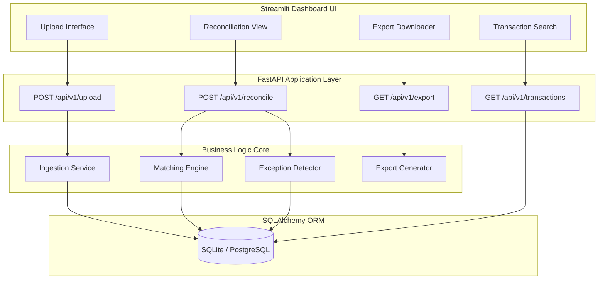

<div align="center">

# 🏦 Payment Reconciliation Platform

*An Enterprise-Grade Fintech MVP for Automated Financial Data Reconciliation*

[](#)
[](#)
[](#)
[](#)
[](#)
[](#)

</div>

---

##  2. Project Overview

In the fintech industry, **Payment Reconciliation** is the critical process of ensuring that internal ledger records align perfectly with external bank settlement statements. Discrepancies can occur due to delayed settlements, gateway fees, system timeouts, or partial refunds, leading to significant financial leakage.

This **Payment Reconciliation Platform** solves this core operational challenge by fully automating the ingestion, parsing, matching, and exception-detection workflows. By leveraging advanced heuristic algorithms and an interactive dashboard, operations teams can reduce manual review times by up to 90%, eliminate human error, and achieve rapid financial close.

---

##  3. Key Features

- **Automated Data Ingestion**: Seamlessly upload and parse both `.csv` and `.xlsx` transaction files natively, with robust schema validation.
- **Advanced Exact Matching**: Precision deterministic matching engine comparing transaction IDs, monetary amounts, and settlement timestamps within configurable SLA tolerances.
- **Heuristic Fuzzy Matching**: Integrates `rapidfuzz` for high-performance string similarity to catch mangled transaction IDs or gateway reference prefixes when times and amounts still align perfectly.
- **Intelligent Exception Detection**: Automatically flags anomalies including *Missing Transactions*, *Duplicate Records*, *Amount Mismatches*, *Delayed Settlements*, and *Refund Mismatches*.
- **Real-Time Interactive Dashboard**: A highly polished Streamlit UI featuring comprehensive analytics, KPI scorecards, dynamic Plotly visualizations, and transaction searching.
- **Enterprise Reporting**: One-click generation of fully styled, multi-sheet Excel reports mapping the entire reconciliation lifecycle.
- **Production Architecture**: Built on Clean Architecture principles featuring SQLAlchemy ORMs, Pydantic data validation, and unified Loguru logging.

---

##  4. System Architecture



---

##  5. Project Structure

```text
payment-reconciliation-tool/
│
├── app/
│   ├── api/                 # RESTful Endpoints (Routers)
│   ├── core/                # Configuration & Loguru Initialization
│   ├── db/                  # SQLAlchemy Engine, Base, & Models
│   ├── schemas/             # Pydantic Request/Response Validation
│   ├── services/            # Core Business Logic Algorithms
│   └── dashboard/           # Streamlit Frontend UI Application
│       └── app.py
│
├── data/                    # Sample Datasets for Testing
├── tests/                   # Pytest Automated Test Suite
├── uploads/                 # Temporary Ingestion Directory
├── requirements.txt         # Project Dependencies
├── .env                     # Environment Variables
├── main.py                  # FastAPI Application Entrypoint
└── README.md                # Project Documentation
```

---

##  6. Tech Stack

| Component | Technology | Description |
|-----------|------------|-------------|
| **Backend API** | FastAPI | High-performance async REST framework |
| **Frontend UI** | Streamlit | Rapid interactive data dashboarding |
| **Database ORM** | SQLAlchemy | Professional database abstraction |
| **Data Processing** | Pandas & NumPy | High-speed vectorized data manipulation |
| **Fuzzy Matching** | RapidFuzz | C++ optimized string similarity scoring |
| **Automated Testing** | Pytest | Scalable API and logic test suite |
| **Report Generation**| XlsxWriter | Complex Excel multi-sheet formatting |

---

##  7. Installation Guide

### Prerequisites
Ensure you have Python 3.9+ and Git installed.

```bash
# 1. Clone the repository
git clone https://github.com/yourusername/payment-reconciliation-platform.git
cd payment-reconciliation-platform

# 2. Create and activate a virtual environment
python -m venv venv
source venv/bin/activate  # On Windows: venv\Scripts\activate

# 3. Install required dependencies
pip install -r requirements.txt

# 4. Configure environment (optional: PostgreSQL setup)
# Edit the .env file if necessary. The system defaults to local SQLite.
```

### Running the Platform

This application requires both the Backend and Frontend to run simultaneously in separate terminals.

**Terminal 1: Start the FastAPI Backend**
```bash
uvicorn main:app --reload
```
*(Backend runs on `http://127.0.0.1:8000`)*

**Terminal 2: Start the Streamlit Dashboard**
```bash
streamlit run app/dashboard/app.py
```
*(Frontend runs on `http://localhost:8501`)*

---

## 📡 8. API Documentation

Comprehensive Swagger UI documentation is available locally at `http://127.0.0.1:8000/docs` while the backend is running.

| Method | Endpoint | Purpose |
|--------|----------|---------|
| `POST` | `/api/v1/upload` | Ingests, cleans, and validates Internal & Bank datasets. |
| `POST` | `/api/v1/reconcile` | Triggers the heavy computation exact & fuzzy matching engines. |
| `GET`  | `/api/v1/results` | Returns paginated matched and unmatched transaction arrays. |
| `GET`  | `/api/v1/exceptions` | Fetches the structured exception registry. |
| `GET`  | `/api/v1/metrics` | Computes aggregation and match-rate metrics for UI display. |
| `GET`  | `/api/v1/export` | Generates and streams a highly-formatted Excel `.xlsx` report. |
| `GET`  | `/api/v1/transactions/{id}`| Global cross-system search returning lifecycle details of a TxID. |
| `GET`  | `/health` | Verifies system uptime and database connectivity. |

---

##  9. Matching Engine Logic

The core value proposition of this platform resides in the dual-layered matching heuristics:

1. **Exact Matching**: Operates in O(N) complexity by merging datasets. A match is confirmed if:
   - `transaction_id` matches exactly.
   - `amount` is within a defined financial tolerance (e.g., ±0.01).
   - `timestamp` is within a defined gateway latency tolerance (e.g., ±5 minutes).
2. **Fuzzy Matching**: Acts as a fallback for records failing exact matching. If time and amounts align, the engine compares transaction IDs using **Levenshtein Distance** (`rapidfuzz.fuzz.ratio`). A match is established if the confidence score exceeds the `80.0` threshold, successfully catching truncated identifiers or arbitrary banking prefixes.

---

##  10. Exception Handling

Following reconciliation, the exception detector scans the remnants to identify explicit business logic failures. Each exception yields a Severity and a Recommendation.

- **Missing Transaction** *(HIGH)*: Exists in the ledger but not at the bank (or vice versa).
- **Duplicate Transaction** *(HIGH)*: Internal double-logging error.
- **Amount Mismatch** *(MEDIUM)*: The IDs match, but the settled amount deviates past the allowed tolerance (potential undisclosed gateway fee).
- **Delayed Settlement** *(LOW)*: Time difference between internal logging and bank settlement exceeds expected SLAs.
- **Refund Mismatch** *(HIGH)*: Critical failure where one system indicates a refund that the other did not process.

---

##  11. Dashboard Overview

The `FinRecon Pro` frontend is engineered for operations teams:
- **KPI Cards**: Immediately visualizes Total Volume, Match Rate %, and Total Exceptions.
- **Analytics Charts**: Utilizes Plotly to render responsive Match Distribution donuts and Exception Breakdown bar graphs.
- **Interactive Tables**: Exception registries equipped with live multi-select filtering for rapid triaging.
- **Global Search**: Deep-dive search functionality returning ledger data alongside match status and attached exceptions for any given transaction.

---
##  12. Sample Workflow

1. **Upload**: Navigate to *Engine Ops*, upload `internal_transactions.csv` and `bank_transactions.csv`.
2. **Reconcile**: Click "Execute Matching Algorithms" to engage the backend heuristics.
3. **Analyze**: View the *Executive Dashboard* for high-level match rates and identify process failures in the *Exception Command Center*.
4. **Export**: Navigate to *Export & Compliance* to download a fully formatted, multi-sheet Excel report for stakeholder review.

---

##  13. Testing

The application is heavily tested using `pytest`, verifying end-to-end API workflows, ingestion accuracy, and matching engine stability.

```bash
pytest tests/
```
> **✅ 8 tests passed successfully**

---

##  14. Future Improvements

While this MVP is production-ready, scaling to enterprise usage will require:
- **Dockerization**: Wrapping the FastAPI, Streamlit, and database services in `docker-compose`.
- **PostgreSQL Migration**: Transitioning off SQLite onto a fully concurrent Postgres cluster.
- **Authentication**: Securing endpoints with OAuth2 and implementing Role-Based Access Control (RBAC).
- **AI Anomaly Detection**: Integrating Scikit-Learn Isolation Forests to identify fraudulent transaction patterns prior to reconciliation.

---

##  16. Screenshot Placeholders

*Include screenshots here to demonstrate the UI for portfolio reviewers.*

### Executive Dashboard
> `[Insert Screenshot of KPI Dashboard with Plotly Charts]`

### Exception Command Center
> `[Insert Screenshot of Exception Filtering Table]`

### Transaction Search API
> `[Insert Screenshot of the specific Transaction Trace feature]`

### Swagger Documentation
> `[Insert Screenshot of FastAPI Swagger UI]`

---

##  15. Author

Built as a capstone internship engineering project showcasing full-stack fintech architecture, API design, and data processing.

**Author**: [Ashutosh Satapathy](https://github.com/Ashutos45)

---

##  17. License

This project is licensed under the MIT License - see the LICENSE file for details.
